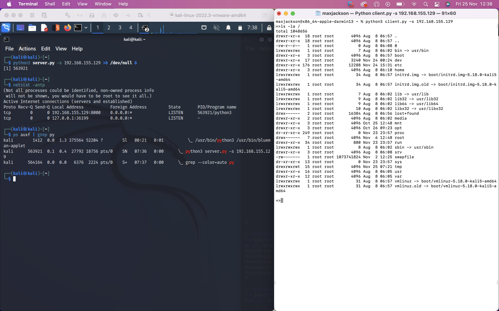

Wait What?..
-----------

Have you ever wanted to over complicate remote code execution? Me neither.  

`Server.py` will listen on a user specified port (default `8000`) for HTTP GET requests with a base64 encoded cookie containing a command to run on the remote machine. It uses `subprocess.Popen` to spawn a new process, execute the command, and retrieve the results, separate from the process the server is running in before returning the results base64 encoded in the `Set-Cookie` response header.  

`Client.py` uses the `requests` module to craft an HTTP GET request with the input command base64 encoded in the cookie header. It parses the response for the `Set-Cookie` header and outputs the decoded results to the terminal. `Client.py` uses the `cmd` module to provide a command interpreter then uses the `cmdloop` method to repeatedly issue a prompt.

I was more interested in creating this to see what artifacts I could find on the victim machine (the one running server.py) to indicate there was an HTTP connection being used to transfer data to a remote attacker (me).

Example
-------

In the left window is the client, a kali Linux VM with eth0 ip address 192.168.155.129. The right side is the server, my macOS host with eth0 ip address 192.168.0.8. The client executes the command `id` and receives the result from the server.

Artifacts
---------
I'll run the server on my linux box and the client on my mac for this as I'd rather be on the linux terminal than the mac to be honest. I'll kick off the server with the command line `python3 server.py -s 192.168.0.8 >& /dev/null &`. The `>& /dev/null` redirects standard error and standard out to `/dev/null` so it won't show those `192.168.155.1 - - [25/Nov/2022 07:03:14] "GET / HTTP/1.1" 200 -` messages, and the final `&` will execute the program in the background so I can continue to use the terminal. First the obvious

`netstat -antp` and `ps auxf` show the listener on port `8000` and the process associated with the instance of server.py. That's fine but python scripts run all the time and hosts commonly listen on ports like `8000` so what?

