# Summary

<details open>
<summary> </summary>

* [Why](#wait-why-would-you-make-this)
* [Example](#example)
* [Network Artifacts](#network-artifacts)
* [ps and /proc](#ps-and-proc)
* [Memory Forensics](#memory-forensics)
 
</details>
  
Wait Why Would You Make This?
-----------

Have you ever wanted to over complicate remote code execution? Me neither.  

I was more interested in creating this to see what artifacts I could find on the victim machine (the one running server.py) to indicate there was an HTTP connection being used to transfer data to a remote attacker (me).

`Server.py` will listen on a user specified port (default `8000`) for HTTP GET requests with a base64 encoded cookie containing a command to run on the remote machine. It uses `subprocess.Popen` to spawn a new process, execute the command, and retrieve the results, separate from the process the server is running in before returning the results base64 encoded in the `Set-Cookie` response header.  

`Client.py` uses the `requests` module to craft an HTTP GET request with the input command base64 encoded in the cookie header. It parses the response for the `Set-Cookie` header and outputs the decoded results to the terminal. `Client.py` uses the `cmd` module to provide a command interpreter then uses the `cmdloop` method to repeatedly issue a prompt.

Example
-------
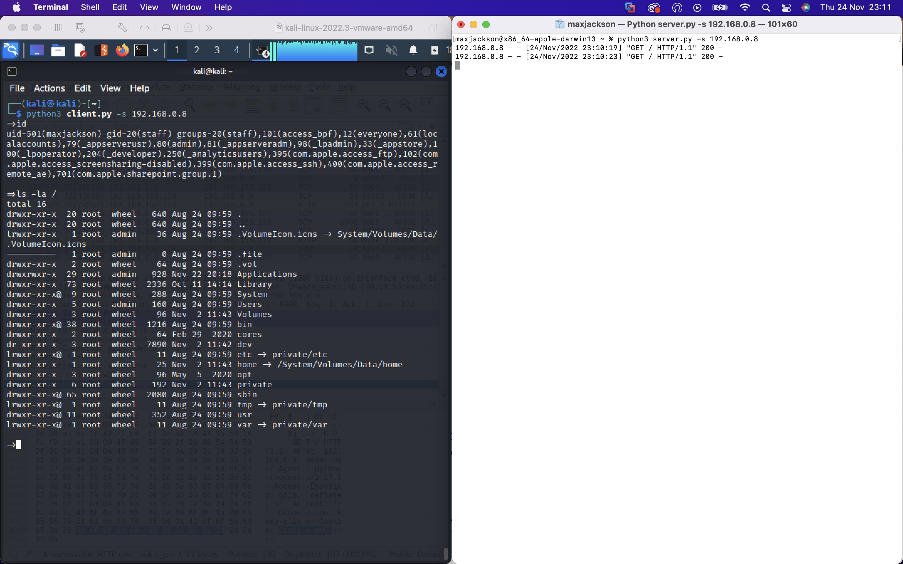

In the left window is the client, a kali Linux VM with `eth0` ip address `192.168.155.129`. The right side is the server, my macOS host with `eth0` ip address `192.168.0.8`. The client executes the command `id` and receives the result from the server.

Network Artifacts
---------
I'll run the server on my linux box and the client on my mac for this as I'd rather be on the linux terminal than the mac to be honest. I'll kick off the server with the command line `python3 server.py -s 192.168.155.129 >& /dev/null &`. The `>& /dev/null` redirects standard error and standard out to `/dev/null` so it won't show those `192.168.155.1 - - [25/Nov/2022 07:03:14] "GET / HTTP/1.1" 200 -` messages, and the final `&` will execute the program in the background so I can continue to use the terminal. First the obvious

`netstat -antp` and `ps auxf` show the listener on port `8000` and the process associated with the instance of server.py. That's fine but python scripts run all the time and hosts commonly listen on ports like `8000` so what?

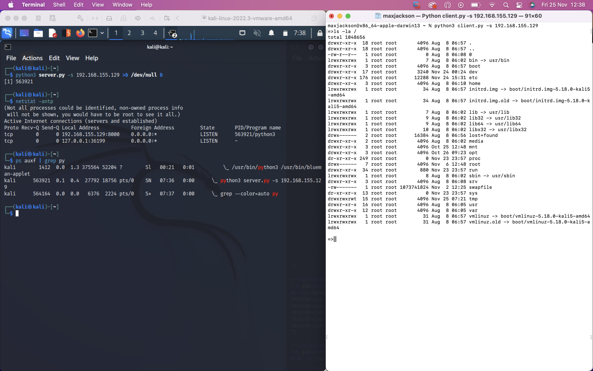

I'll fire up wireshark to capture a request and response between the client and server. I've just entered the `id` command at the client's prompt.

**Client's request**

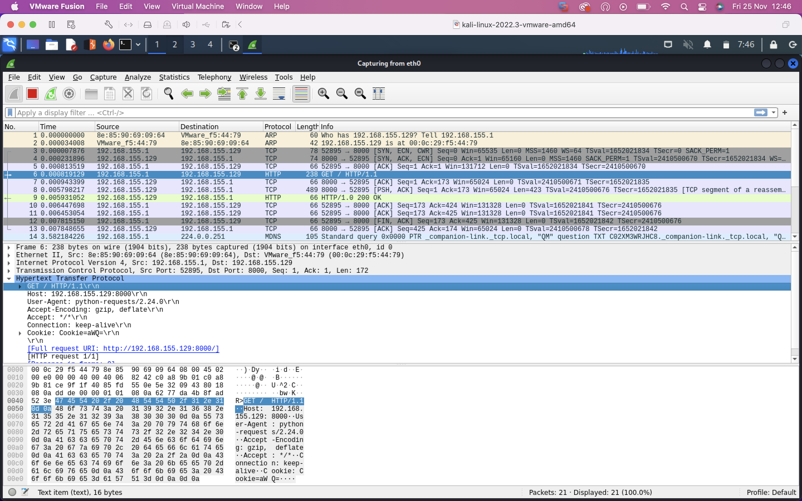

**Server's response**

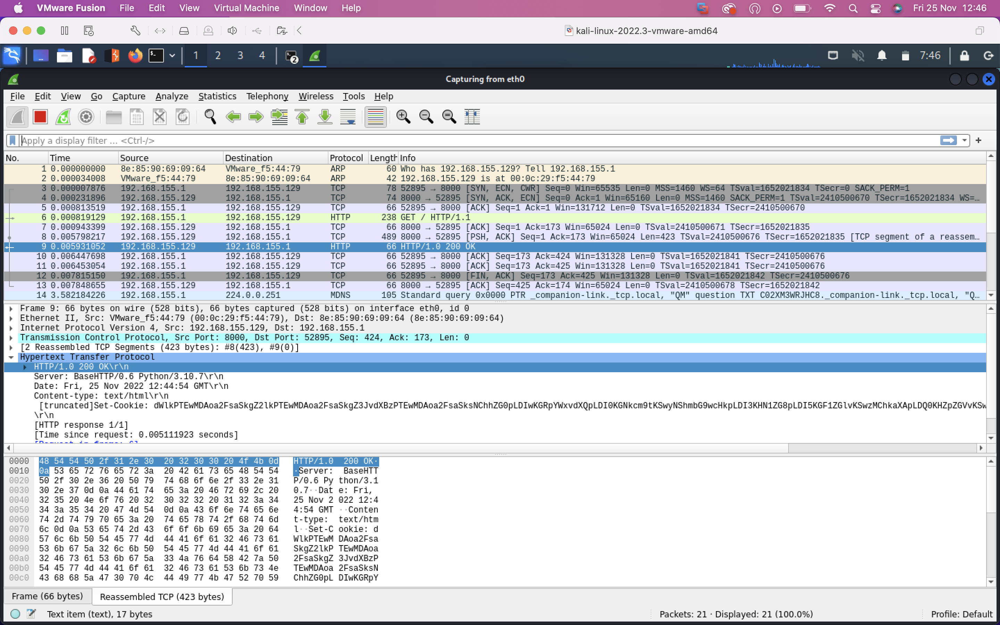

I can immediately pick out the base64 encoded `id` command in the client's cookie and the long base64 encoded response in the server's `set-cookie` header. This feels like cheating though because wireshark is OP but also because I know what to look for. 

So how would you detect this is if you didn't know what's going on? A realistic scenario is an enterprise has a baseline of known normal. They know from past data what ip's people are commonly connecting out to, how often, at what times etc. So when a connection is made to an unknown ip for the first time, and especially when the traffic has user agents like `python-requests 2.24.0` and `BaseHTTP/0.6 Python/3.10.7`, this is stuff that could be alerted on.

It's unrealistic for enterprises to hold full pcaps for any useful length of time, plus pcaps aren't too easy to parse. What we (and SIEMs) like are logs. Zeek is a great tool that can turn packet captures into protocol based logs, i.e. HTTP logs, DNS logs, TLS logs etc. You can forward some or all of these logs to a SIEM and write detection rules to alert on the stuff like the first time an unknown host was resolved in the DNS log, or user agents containing `python` in the http log. 

Netflow would also be handy here as it would allow you to pick up on the inital and to log subsequent connections to the foreign ip, but since netflow is only metadata on network traffic, you couldn't 'look inside' the packets and catch the stuff like the suspicious user agent or decode the cookies to follow the conversation between the client and server.

ps and /proc
------------

Ok but I want to see what evidence I can find left behind on the filesystem. I know the PID  of this python process is `563921` from the output of `ps`. The `/proc` volume is a virtual filesystem created at boot that contains a subdirectory for each running process, labelled by PID. Each subdirectory contains valuable information about the running process. `/proc/563921/cmdline` contains the command typed in the shell used to launch the process, and `/proc/self/environ` lists the environment variables associated with the user who executed that process. 

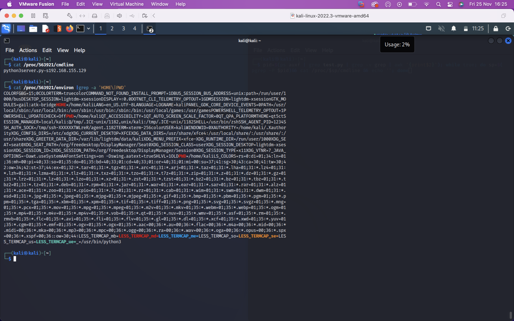

We can see the process was launched with the commandline `python3 server.py -s 192.168.155.129` from the `/home/kali/` directory.

That's nice but I want to see what the attacker has done since they've compromised the box or catch them in the act. I know that the `server.py` process is spawning a subprocess to execute the command supplied in the cookie using `subprocess.Popen` so I wonder if I can catch this process before it exits. I could try 

`watch -n 1 'ps -eo cmd --forest | grep -i python -A5 -B5'`

- `watch -n 1` executes the proceeding command, refreshing on 1 second intervals
- `ps -eo cmd` shows the absolute path to the executable that spawned the process and associated command line arguments
- `--forest` shows the subprocesses spawned from a parent process
- `grep -i python -A5 -B5` filters for processes spawned by python and shows 5 lines above and below

This won't catch the subprocess however as it's being spawned, executing and exiting in well under the 1 second interval `watch` is refreshing on.

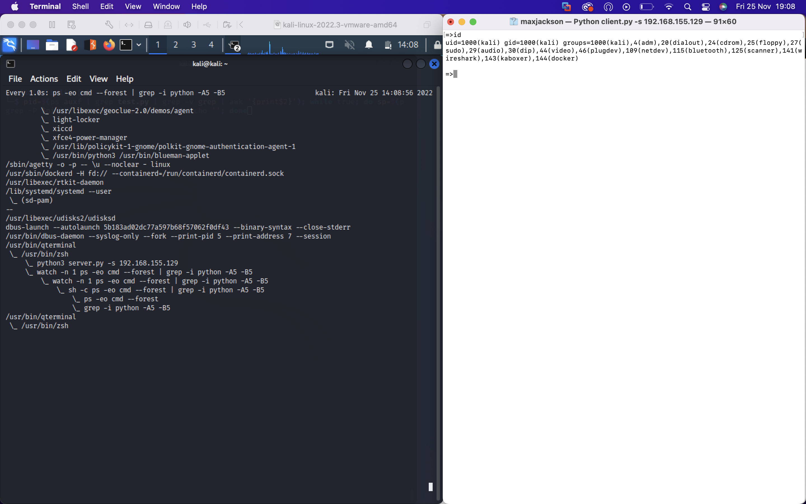

I have another idea though. I know that every process gets a subdirectory in `/proc` based on its `pid`. Maybe I can catch this subdirectory and list the contents before it gets removed. For this I'll use the following command

`pid=$(ps auxf | grep server.py | grep -v grep | awk '{print$2}'); while true; do subpid=$(pgrep -P $pid) && ls -la /proc/$subpid/ && echo ''; done`

1. The first bit inside the `$()` just greps out the `pid` of the parent process from the output of `ps`
2. `pgrep -P $pid` matches all processes whose ppid is the `server.py` process, so it'll catch the pid of the `subprocess.Popen` process
3. `&& la -ls /proc/$subpid` says if the preceeding command executes sucessfully, list the contents of this subprocess' subdirectory in `/proc`

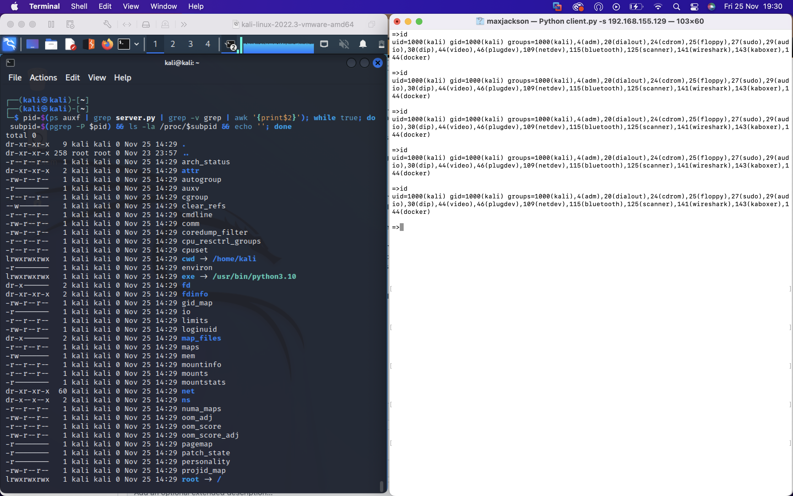

It take a few tries to win the race condition of catching the directory before it's removed but it works!

I'll cheat here a bit for the purposes of demonstration. I'll modify the `client.py` code to suspend the process for a split second so I can reliably win the race condition. I imported the `psutil` and `time` libraries and made the following changes. What was:

`output = subprocess.Popen(command, shell=True, stdout=subprocess.PIPE, stderr=subprocess.STDOUT).communicate[0]`

is now 
```
P = subprocess.Popen(command, shell=True, stdout=subprocess.PIPE, stderr=subprocess.STDOUT)
process = psutil.Process(pid=P.pid)
process.suspend()
time.sleep(0.01)
process.resume()
output = P.communicate()[0]
```
all this does is create a new process to execute `command`, get a handle on the process represented by `P`, suspend its execution, wait 0.01 seconds, resume its execution and grab stdout once the process has executed.

I'll change the command from doing `ls -la /proc/$subpid` to `cat /proc/$subpid/cmdline` and we get the results. We can see that attacker executed the `id` command.

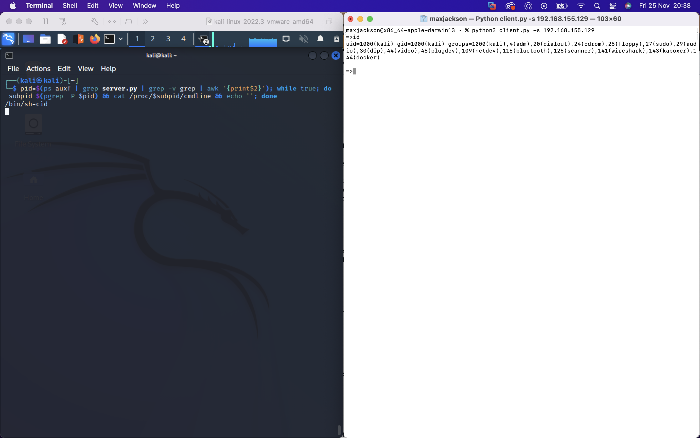

Memory Forensics
----------------

`/proc/<pid>/maps` describes a region of contiguous virtual memory in a process or thread. So it contains a map of the shared objects/libraries loaded by the process and the locations where the process writes to. Each row contains the fields

```
address           perms offset  dev   inode   pathname
08048000-08056000 r-xp 00000000 03:0c 64593   /usr/sbin/gpm
```

I know that the result of the commands the attacker is sending is being written to memory. The stack is structured but the heap is for dynamically allocating unstructured data, and the results of an arbitrary command the attacker sends are both dynamic in nature (don't know when the command will come through) and unstructured (who knows what/how long the output will be). So I'd like to check out the heap.

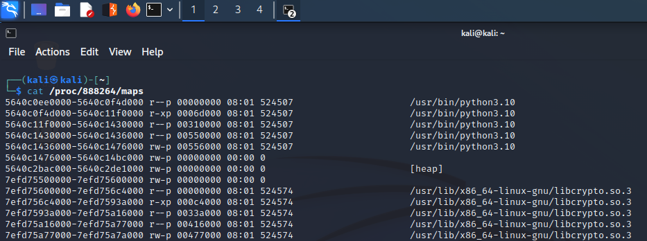

This tells me the heap starts at 0x5640c2bac000 and ends at 0x5640c2de1000. I can use `dd` to read from the heap. `dd` is a command line utility to convert and copy files. I'll run the command

`dd if=/proc/888264/maps bs=1 skip=$((0x5640c2bac000)) count=$(($((0x5640c2de1000))-$((0x5640c2bac000)))) of=/tmp/heap`

this means read from /proc/888264/maps with a block size of 1 byte, starting at address 0x5640c2bac000 for 2314240 bytes (up until the end of the heap) and save the output to `/tmp/heap`

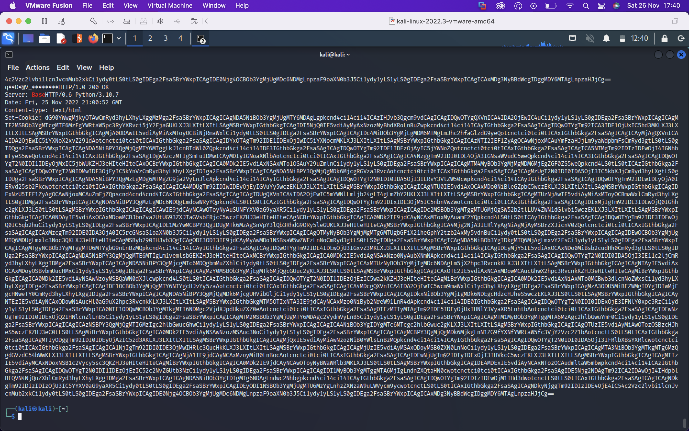

we can see the server's response including the baes64 encoded output of the command sent by the client in the `Set-Cookie`

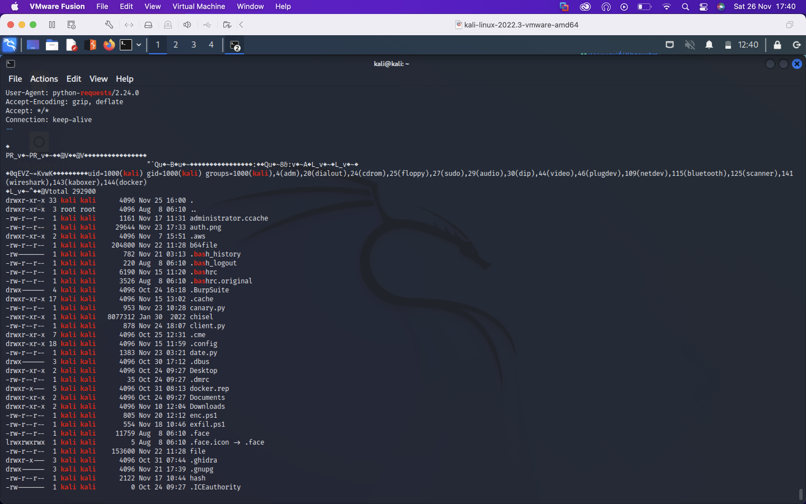

we even get the cleartext output of the commands the attacker remotely executed.

Awesome.
